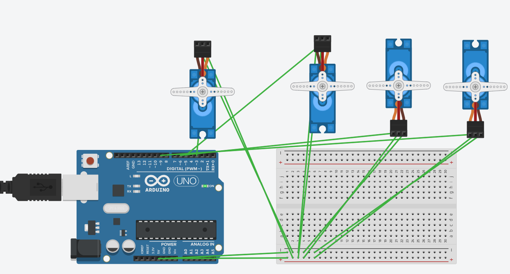

# Four Servo Motors Control using Arduino (Tinkercad)

## Overview
This project demonstrates how to control four servo motors simultaneously using an Arduino Uno in Tinkercad. The motors move together from 0° to 180°, return to 0°, and finally stop at 90°.

## Components
- Arduino Uno
- Breadboard
- 4 Servo Motors
- Jumper Wires
- Tinkercad

## Project Preview

---

## Features
- Control four servo motors simultaneously.
- Synchronized movement from 0° to 180°.
- Return movement from 180° to 0°.
- Final stop at 90°.
- Built using Arduino (C++).
- Simulated in Tinkercad.

## Technologies Used
- Arduino (C++)
- Tinkercad

## Project Link
https://www.tinkercad.com/things/g3tKetGcL3U-super-kasi-esboo
## Author
**Atheer Alharbi**
